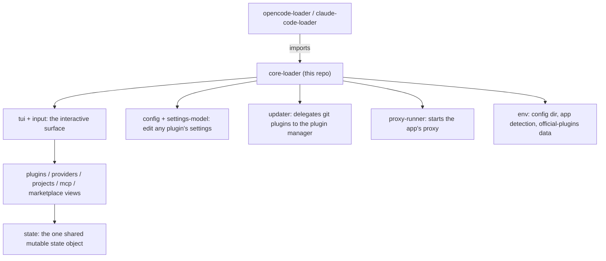

# core-loader

The shared engine both app loaders are built from. It holds the generic loader
logic (the TUI and its input handling, the plugins/providers/projects/MCP views,
marketplace browsing, config editing, and the proxy runner) as one source of
truth, so `opencode-loader` and `claude-code-loader` differ only in their
app-specific paths and names.

Compiled from the submodule, and published as `@intisy-ai/core-loader` so a
loader installed from npm resolves it as a dependency instead of inlining a copy.

## Under-the-Hood Architecture



This library is **generic**: it contains no per-app job. Anything app-specific
(config filenames, home directories, labels) belongs to the loader that consumes
it, never here. Note that core-loader deliberately carries no `core` submodule,
which is why a few small facts (such as the plugin manager's package name in
`src/env.ts`) live here rather than being asked of core.

## Structure

- `src/tui.ts`, `src/input.ts`, `src/input-cause.ts`, `src/selection.ts`,
  `src/out.ts`, `src/format.ts` — the terminal surface and its rendering
- `src/plugins.ts`, `src/provider-rows.ts`, `src/provider-catalog.ts`,
  `src/provider-def.ts`, `src/custom-provider.ts`, `src/account-menu.ts`,
  `src/projects.ts`, `src/mcp.ts`, `src/marketplace.ts` — the views
- `src/state.ts` — the single shared mutable state object
- `src/config.ts`, `src/settings-model.ts`, `src/json.ts` — config reading and
  editing (`readJson` / `readJsonc` are the one JSON entry point)
- `src/loader-runtime.ts`, `src/loader-commands.ts`, `src/wrapper.ts`,
  `src/ensure-app.ts` — activation, command deployment, and the app wrapper
- `src/updater.ts`, `src/config-ledger.ts`, `src/activity-seam.ts`,
  `src/notify.ts` — the seams to the plugin manager and to notifications
- `data/official-plugins.json` — the badged official marketplace section
- `dist/` — compiled output (generated; not committed)

There is no barrel module: consumers import the module they need directly
(`core-loader/dist/loader-runtime.js`, `core-loader/dist/wrapper.js`, ...). The
package builds to CommonJS.

## Installation

As a submodule, for a loader built in this ecosystem:

```bash
git submodule add https://github.com/intisy-ai/core-loader core-loader
```

Or as an npm dependency:

```bash
npm install @intisy-ai/core-loader
```

## Configuration

core-loader has no config file of its own. It reads and edits the *consuming
loader's* config and, through `settings-model`, any installed plugin's settings.
The config dir it defaults to can be overridden with `HUB_CONFIG_DIR`.

## Logging

This library writes no logs of its own. The consuming loader owns logging, via
core's `makeWriteLog(name)`, so lines appear under that loader's name.

## License
MIT
